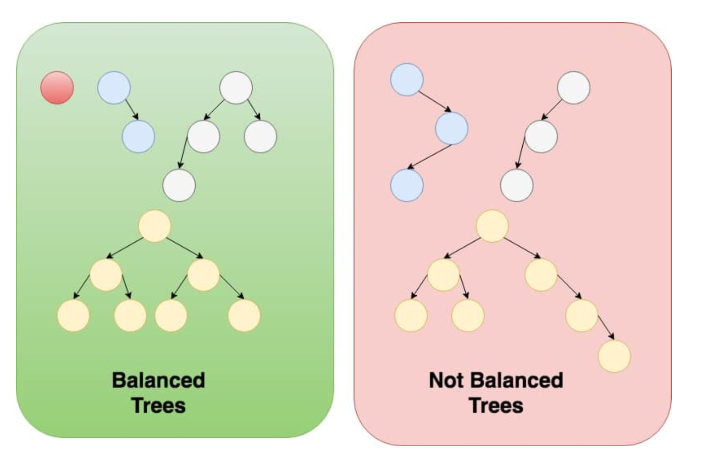

<h1>balanced-binary-tree</h1>

<p>A binary tree is balanced if for each node in the tree, the difference between the height of the right subtree and the left subtree is at most one.</p>

<p>Write a program to check if a binary tree is Balanced. Display the tree in the terminal output with the result for below inputs-</p>

<p>1.Tree is empty.</p>
<p>2.Tree has > 15 nodes and not balanced.</p>
<p>3.Tree has > 15 nodes and balanced. </p>

<h3>Example of balanced and unbalanced binary tree:</h3>


```bash
use the below command to run the code:
Step 1: g++ -o main constructBinaryTree.cpp
Step 2: ./main.out
Then select the choice and it will display the tree and also show whether it is balanced or not.
```